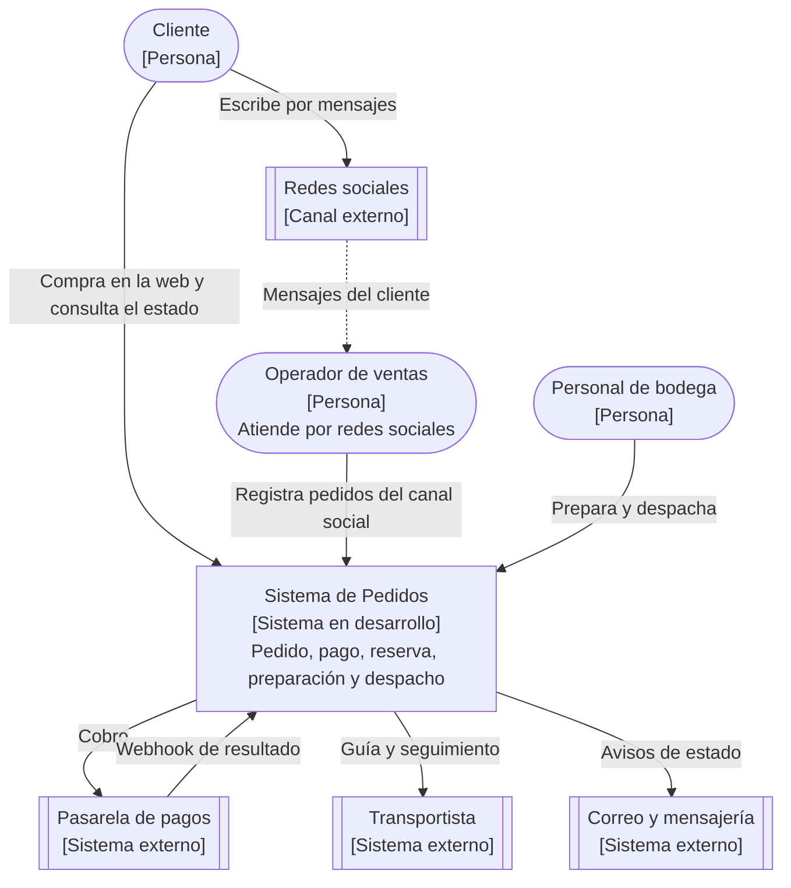
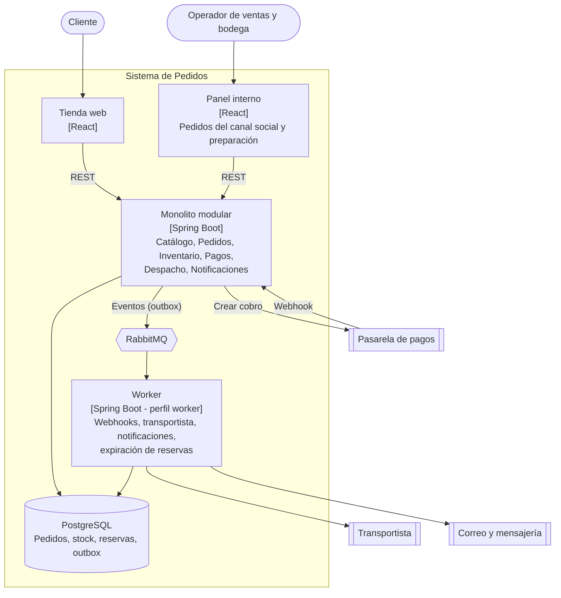
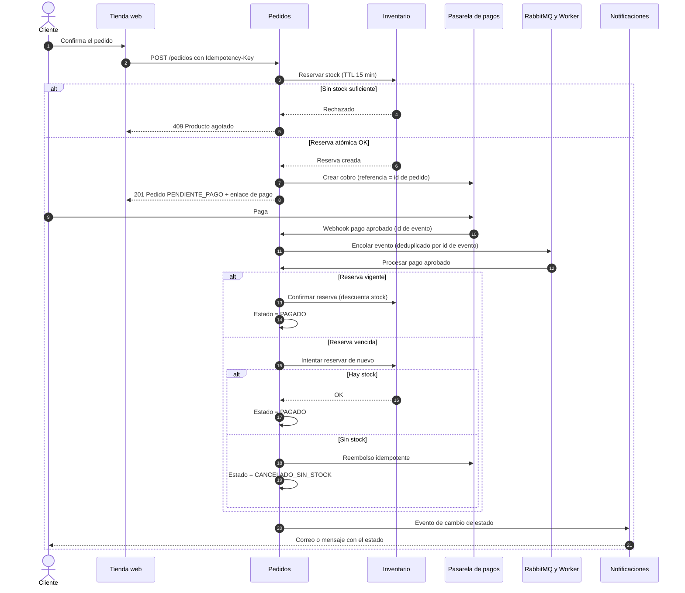

# Ejercicio 4 — Pedidos de una tienda en línea

> **Diseño de Sistemas** · Taller de arquitectura · Ejercicio 4 de 4

| | |
|---|---|
| **Autor** | Joshua Ribadeneira |
| **Curso** | Diseño de Sistemas |
| **Diagramas** | Mermaid |

## Contenido

- [Decisiones clave del enunciado](#decisiones-clave-del-enunciado)
- [1. Objetivo, actores y alcance](#1-objetivo-actores-y-alcance)
- [2. Requisitos funcionales y de calidad](#2-requisitos-funcionales-y-de-calidad)
- [3. Diagramas C4](#3-diagramas-c4)
- [4. Flujo de una operación crítica: del pedido al pago, con compensación](#4-flujo-de-una-operación-crítica-del-pedido-al-pago-con-compensación)
- [5. Stack propuesto y justificación](#5-stack-propuesto-y-justificación)
- [6. Dos ADR](#6-dos-adr)
- [7. Tres riesgos y cómo reducirlos](#7-tres-riesgos-y-cómo-reducirlos)
- [8. Métricas](#8-métricas)
- [Estructura del repositorio](#estructura-del-repositorio)
- [Verificación de cumplimiento](#verificación-de-cumplimiento)

## Decisiones clave del enunciado

| Pregunta | Decisión | Justificación |
|---|---|---|
| ¿Cuándo se reserva el inventario? | **Al confirmar el pedido, antes de cobrar**, con **vencimiento (TTL) de 15 min**. El pago aprobado confirma la reserva; si el pago falla o vence, se libera | Evita vender dos veces el último producto entre web y redes sociales. Reservar en el carrito permitiría bloquear stock sin intención de compra; reservar después del pago generaría cobros sin stock. |
| ¿Pago aprobado pero falla la reserva? | **Compensación automática**: si la reserva venció, se intenta reservar de nuevo; si no hay stock, **reembolso idempotente**, pedido `CANCELADO_SIN_STOCK` y aviso al cliente (con disculpa o cupón) | Ocurre sobre todo cuando el pago aprueba tarde (webhook retrasado). Se trata como saga con pasos compensables. |
| ¿Cómo se informa el estado? | Página «Mi pedido» (consulta REST), **correos y mensajes por cada cambio de estado** y número de seguimiento del transportista | Los cambios de estado generan eventos; las notificaciones se envían en segundo plano y no retrasan al pedido. |
| ¿Qué operaciones son idempotentes? | Crear pedido, procesar webhook de pago, reservar/confirmar/liberar stock, reembolsar, crear guía de envío, enviar notificaciones y toda transición de estado | Todas se reintentan por red inestable, webhooks duplicados o reprocesos de colas. Cada una lleva una clave de deduplicación. |
| ¿Qué podría separarse a futuro? | En orden de probabilidad: **Notificaciones**, **Pagos**, **Inventario**; después Catálogo/búsqueda y Envíos. **Pedidos** queda como núcleo | Los módulos ya se comunican por interfaces y eventos, así que extraerlos no exige reescribir el dominio. |

## 1. Objetivo, actores y alcance

**Objetivo.** Controlar el pedido desde su confirmación hasta el despacho, sea cual sea el canal (web o redes sociales): cobrar, reservar inventario, preparar, enviar e informar al cliente en cada etapa.

**Actores.**
- **Cliente:** compra en la web, consulta el estado.
- **Operador de ventas:** atiende por redes sociales y registra el pedido en el panel interno.
- **Personal de bodega:** prepara y despacha.
- **Administrador:** catálogo, stock y reportes.
- **Pasarela de pagos, transportista, correo y mensajería** (externos).

**Alcance.**
- *Dentro:* catálogo y disponibilidad, creación de pedidos (web y panel), reserva, pago, preparación, despacho con guía, notificaciones, cancelaciones y auditoría de estados.
- *Fuera:* compras a proveedores, contabilidad, devoluciones posteriores a la entrega, entrega final (solo hasta el despacho).

**Supuestos.** El cobro usa una pasarela con página de pago alojada y webhooks (no se guardan datos de tarjeta). El stock es único y compartido entre canales. Los pedidos de redes sociales los registra un operador, no un bot.

## 2. Requisitos funcionales y de calidad

**Funcionales**
- RF1. Mostrar catálogo con disponibilidad real.
- RF2. Crear pedido desde la web y desde el panel interno (canal social).
- RF3. Reservar inventario de forma atómica con vencimiento.
- RF4. Iniciar el cobro y procesar el resultado (webhook) de la pasarela.
- RF5. Manejar estados: `PENDIENTE_PAGO → PAGADO → EN_PREPARACION → DESPACHADO`; ramas `EXPIRADO`, `CANCELADO`, `CANCELADO_SIN_STOCK`.
- RF6. Generar lista de preparación y registrar el despacho con guía y seguimiento.
- RF7. Notificar al cliente cada cambio de estado; consulta «Mi pedido».
- RF8. Cancelar pedidos permitidos (antes del despacho) y liberar stock o reembolsar.
- RF9. Auditar las transiciones de estado.

**Calidad**
- **Integridad de stock:** cero sobreventas.
- **Rendimiento:** confirmación de pedido p95 < 1,5 s; webhook de pago procesado en < 30 s.
- **Idempotencia** en todas las operaciones de la tabla de decisiones.
- **Disponibilidad:** 99,5 %; si caen transportista o mensajería, los pedidos siguen entrando.
- **Seguridad:** sin datos de tarjeta en el sistema, firma verificada en webhooks, JWT para el panel.
- **Observabilidad:** trazabilidad por pedido, alertas de pedidos atascados en un estado.
- **Evolutividad:** módulos con interfaces y eventos para extraer componentes sin reescribir.

## 3. Diagramas C4

### 3.1 Nivel 1 — Contexto



### 3.2 Nivel 2 — Contenedores



## 4. Flujo de una operación crítica: del pedido al pago, con compensación



**Garantías clave.** El webhook se responde rápido (`200`) tras validar la firma y guardar el evento; el procesamiento ocurre en segundo plano y se deduplica por el id del evento de la pasarela. Una conciliación periódica contra la pasarela detecta pagos que nunca llegaron como webhook.

## 5. Stack propuesto y justificación

| Capa | Elección | Por qué |
|---|---|---|
| Backend | Spring Boot (Java 21) + Spring Modulith | Transacciones fuertes para pedido, stock y reserva; módulos listos para separarse. Node.js sería viable; se elige Spring Boot por su soporte transaccional maduro, Spring Modulith para las fronteras de módulo y para mantener un solo stack en los cuatro sistemas. |
| Base de datos | PostgreSQL | Reserva atómica con `UPDATE` condicional, outbox, estado de pedidos y auditoría en un solo motor. |
| API | REST (OpenAPI) | Contrato único para tienda web y panel interno. |
| Interfaz | React (tienda web y panel interno) | Dos aplicaciones, un backend; el panel permite registrar pedidos de redes sociales y preparar despachos. |
| Mensajería | **RabbitMQ** (se incorpora) | Está justificada: hay tres integraciones externas (pasarela, transportista, mensajería) y tareas asíncronas con reintentos (webhooks, guías, notificaciones, expiración de reservas). |
| Pagos | Pasarela con página alojada y webhooks | No se tocan datos de tarjeta; menor alcance de seguridad. |
| Despliegue | Docker | Reproducible; worker como perfil del mismo artefacto. |
| Caché | Redis: no incluido | Sin necesidad demostrada; la disponibilidad se lee de PostgreSQL con índices. |

## 6. Dos ADR

Cada ADR también está como archivo individual en [`docs/adr/`](docs/adr/).

**ADR-001 — Saga orquestada dentro del monolito, con reserva primero y compensaciones** · Estado: Aceptada · Tipo: arquitectónica
- **Contexto:** pedido, inventario y pago deben quedar coherentes aunque el pago llegue tarde, duplicado o no llegue; no hay transacción distribuida posible con la pasarela.
- **Decisión:** el módulo Pedidos orquesta una **saga** con máquina de estados explícita: reservar → cobrar → confirmar reserva → preparar → despachar. Cada paso con efecto externo tiene su compensación (liberar reserva, reembolsar). Todo corre en un monolito modular; los efectos externos salen por outbox + RabbitMQ.
- **Alternativas:** coreografía entre microservicios (rechazada: más difícil de razonar y depurar a esta escala); reservar solo después del pago (rechazada: cobros sin stock); transacción única (imposible con la pasarela).
- **Consecuencias:** (+) flujo legible y auditable, fallos tratados de forma explícita, módulos separables más adelante. (−) hay que diseñar y probar cada compensación; el monolito debe mantener sus fronteras internas.

**ADR-002 — Reserva de inventario con `UPDATE` condicional atómico en PostgreSQL** · Estado: Aceptada · Tipo: tecnológica
- **Contexto:** varios clientes pueden comprar el mismo producto a la vez desde la web y las redes sociales; no puede haber sobreventa.
- **Decisión:** la reserva se hace con una sola sentencia: `UPDATE stock SET reservado = reservado + :q WHERE sku = :s AND (disponible - reservado) >= :q`; si afecta 0 filas, no hay stock. Cada reserva se guarda con pedido, cantidad y vencimiento; un worker libera las vencidas. Confirmar y liberar usan la clave `(pedido_id, sku)` para ser idempotentes.
- **Alternativas:** contador en Redis (rechazada: segunda fuente de verdad que puede divergir); bloqueo optimista por versión (viable, pero con reintentos frecuentes en picos); bloqueo pesimista sobre la fila (rechazada: contención).
- **Consecuencias:** (+) correcto bajo concurrencia, simple y sin infraestructura nueva. (−) la fila de stock de productos muy populares es un punto caliente; si el volumen crece se separa Inventario y se particiona o se usa un contador por lotes.

## 7. Tres riesgos y cómo reducirlos

| Riesgo | Impacto | Mitigación |
|---|---|---|
| **Sobreventa** en picos de demanda (campañas en redes) | Alto | Reserva atómica con TTL, pruebas de carga concurrentes, stock de seguridad configurable y monitoreo de reservas vencidas. |
| **Inconsistencia pago–pedido**: webhooks duplicados, perdidos o tardíos | Alto | Deduplicación por id de evento, conciliación periódica contra la pasarela, compensación automática (reintentar reserva o reembolsar) y alerta de pedidos atascados en `PENDIENTE_PAGO`. |
| **Caída de transportista o mensajería** bloquea despachos o avisos | Medio | Desacople por cola con reintentos y *backoff*, modo manual en el panel (guía a mano), notificaciones diferidas y *circuit breaker*. |

## 8. Métricas

| Métrica | Tipo | Definición | Meta inicial | Fuente |
|---|---|---|---|---|
| **Tiempo entre compra y despacho** | **Negocio (principal)** | Mediana y p90 desde `PAGADO` hasta `DESPACHADO` | mediana < 24 h | Historial de estados |
| Pedidos completados | Negocio | Despachados ÷ confirmados | ≥ 92 % | Pedidos |
| Cancelaciones | Negocio | Cancelados ÷ confirmados, por causa | < 5 % | Pedidos |
| **Errores de pago** | **Técnica (principal)** | Fallos técnicos (timeout, webhook no procesado, discrepancia) ÷ cobros, sin contar rechazos del emisor | < 1 % | Métricas y conciliación |
| Webhooks procesados a tiempo | Técnica | % procesados en < 30 s | ≥ 99 % | Cola y logs |
| Sobreventas | Calidad | Pedidos pagados sin stock | **0** | Compensaciones |

## Estructura del repositorio

```text
diseno-sistemas-ej4-pedidos-tienda-en-linea/
├── README.md                      <- documento completo del ejercicio
└── docs/
    ├── adr/
    │   ├── adr-001-saga-orquestada-en-el-monolito.md
    │   └── adr-002-reserva-atomica-con-update-condicional.md
    └── diagrams/
        ├── c4-nivel1-contexto.mmd
        ├── c4-nivel2-contenedores.mmd
        └── flujo-pedido-pago-compensacion.mmd
```

Los archivos `.mmd` contienen el código fuente de cada diagrama; se pueden abrir y editar en <https://mermaid.live>.

## Verificación de cumplimiento

| Entregable solicitado | Dónde está |
|---|---|
| Objetivo, actores y alcance | §1 |
| Requisitos funcionales y de calidad | §2 |
| Diagrama C4 de contexto y contenedores | §3.1 y §3.2 (fuentes en `docs/diagrams/`) |
| Flujo de una operación crítica | §4 |
| Stack propuesto con justificación | §5 |
| Dos ADR (una arquitectónica y una tecnológica) | §6 y `docs/adr/` |
| Tres riesgos y cómo reducirlos | §7 |
| Una métrica de negocio y una técnica | §8 (marcadas como «principal») |
| Decisiones que debes tomar | Tabla «Decisiones clave del enunciado» |
